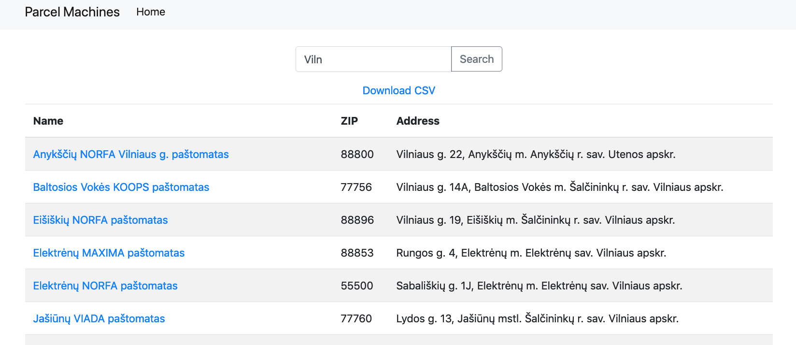

# PARCEL MACHINES

This app gathers data for parcel machine locations around the Baltic states from remote API and automatically synchronize database once every 24 hours. Visitors are able to view, search and export information about the parcel machines.

[Live Demo Link](https://parcel-machines.herokuapp.com/)



## Built With

- Ruby 2.7.2
- Ruby on Rails 6.0.4.1
- Bootstrap 4.3.1
- Postgresql 13.3

### To get a local copy up and running:

1. Clone this repository.

   ```
   git clone https://github.com/zilton7/mijora-challenge.git
   ```

2. Navigate to the location of the folders you have cloned and
   Instal gems with:

   ```
   bundle install
   ```

3. Setup database with:

   ```
   rails db:create
   rails db:migrate
   ```

4. Run (or set as cronjob) the rake task to gather data from API

   ```
   rake sync_data:sync
   ```

5. Run application with:

   ```
   rails server
   ```

## Author

**Zil Norvilis**

[](https://github.com/zilton7)  
[](https://www.linkedin.com/in/zil-norvilis/)  
[](https://twitter.com/devnor7)
